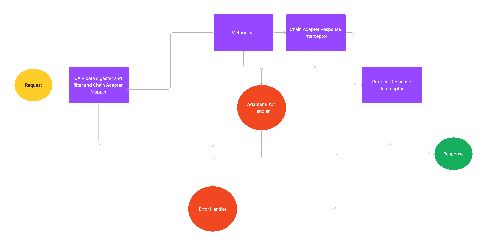

## Title
Protocol CAIP compatible REST API based method calling

## Abstract

`Protocol` is a service providing blockchain communication as REST API. The main focus of **Protocol** is `chain agnosticism` and easy to use. 


## Specification

* **Protocol** provides *REST API* endpoints only for few most used abstract functions. These abstract functions are either direct functions like `getBalance` or indirect/composite function like `getAddressAllTransaction`, which is not natively supported by chains like ethereum and third-party API is required.
* REST API supports `GET`, `POST`, `PUT`, `PATCH` and `DELETE` methods accordingly.
* Transmission of CAIP data such as **chainId**, **accountId** or **assetId** 
    * As plain text when sent in the body of `POST`, `PUT` or `PATCH` request.
    * When CAIP data containing `:` or `/` is required to sent as url path or query params must either be encoded or divided into components.
* Each request handler will have to choose chain adapter for execution of function. The suitable chain adapter will be selected using `chainId`.
    * Chain Adapter mapper should be able to load dedicated chain adapter using the CAIP chainId.
    * A fallback chain adapter can be associated with each chainId namespace which acts as default if no particular chain adapter is found. For example, `Ethereum` chain adapter works for `Polygon` and both have same chain *namespace*, setting a fallback chain adapter for the namespace will work if no particular chain adapter is created for `Polygon`.
    * A list of chainId is maintained to block these from using the fallback chain adapter.
* A *CAIP* data digester will read each data in `params` decoding the encoded data and combining the divided data.

* CAIP filter must be called for each request for blocking or reverting any unsupported request. The main aim is to only serve compatibility issues. Options to block `chainId` (*namespace*, *reference* separately), `assetName` (*namespace*, *reference* separately).

* Descriptive error must be thrown to block the use of resources such as, `ChainNotSupported` when a chain is not supported by **Protocol**.

* Chain adapters can provide a method for making raw rpc requests. 
* External request from **Protocol** to the *node* or *Third-party API* will have dedicated response-error handler
* Each method response must be validated again using the schema




### Flow

- `CAIP digester, filter and mapper`
    - Digest CAIP data to produce meaningful data after decoding or combining.
    - Filter based on chain adapter mapper and/or custom rpc node
    - Map and return the suitable chain adapter
- `Method call`: execute procedure method 
- `Adapter Error handler`: Converts RPC or third-party errors into Native Error.
- `Error Handler`: Handles the response to be sent back, along with logging.
- `Protocol Response Interceptor`: 
    - Format the response.
    - Logging and crediting


### Format of Response data
```ts
interface Response {
    hasError: boolean
    data?: any
    error?: {
        errorMessage: string;
        errorCode?: number
    }
}
```


### Encoding of data 
* `Base64` and `JSON string` are the only supported encodings.
* IF `ENC(x: string)` is the encoding function and `OUT(algo: string, x:string)` is the string data sent over the request then `OUT(algo, x) = algo + "." + ENC(x)`.
* IF `DEC(algorithm: string, x: string)` is the decoding function `OUT(x: string)` is the main data then `OUT(x) = x if "." not in x else DEC(...x.split("."))`.
* Nested encoding can also be done. For example 
    ```ts
    data = {name: 'Almight', age: 34}

    // Function which converts object to JSON string
    JSON(x: string) = OUT("json", x)

    // Function which converts string to base64 string
    Base64(x: string) = OUT("base64", x) 

    final_data(x) = Base64(JSON(x))
    ```
* Nested decoding can be done using while loop where loop will continue until not `.` is present.
    ```ts
    final_data // Data from the above
    data = final_data

    // x is data after "." split 
    // if json.errgfbghgh is the string then x=errgfbghgh 

    // Function which decodes JSON string
    JSON(x: string) = DEC("json", x)

    // Function which decodes Base64 string
    Base64(x: string) = DEC("base64", x)

    while "." in data {
        algoMap = {"base64": Base64, "json": JSON}
        splittedData = data.split(".")
        data = alogMap[splittedData[0]](splittedData[1])
    }

    ```

### Component separation of CAIP data
* Component separation of CAIP is not supported yet.
* Currently, only method of sending formatted CAIP data is encoded data.

### Expected errors

* `ChainNotSupported`: ChainID is not supported by the method.
* `InvalidValueError`: When any value is provided which fails *schema validation* or type validation.
