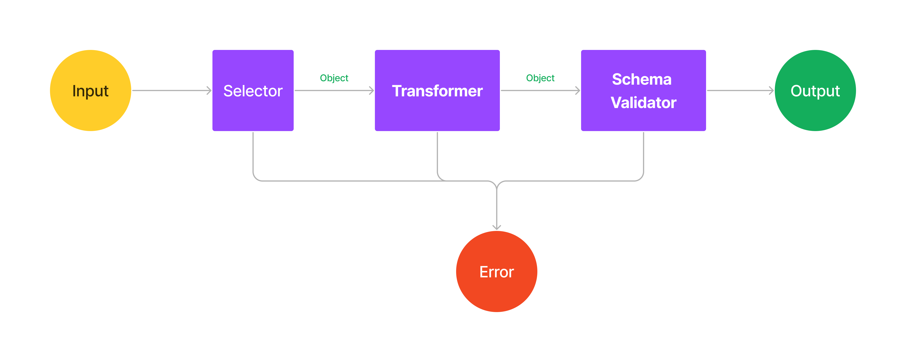

## Title
Adapter based multi-chain method design implementation 
## Abstract

### Context
* Protocol
* Typescript 

In protocol each method such as `getBalance`, `sendTransaction`, etc, have dedicated REST API endpoint. In case of single chain the implementation works perfectly, but when working with multiple chains a concrete design is required because same functions can have different signature.

Considering the endpoints are abstract methods and any chain may or may not directly support the method but the endpoint handler will have to accomplish the task via single or multiple function executions. 

```ts
// Ethereum
getBalance(address: string, tag?: "latest" | "earliest")

// Solana
getBalance(address: string, config?: {commitment: string, minContextSlot: number})
```
## Specification

* Each chain class can be executable independently. 

* Use of `method decorator` and `parameter decorator` is utilized from Typescript.

* Data can be selected from params, body directly.
    ```ts
    class SolanaceChainAdapter {

        @Validate
        async getBalance(@Body("address") address: string | object, 
        @Body({"commitment": "commitment", "minContextSlot": "minContextSlot"}, schema= {
            "commitment": IsString().allowed(["confirmed", "finalized"]),
            "minContextSlot": IsNumber()
        }) config?: {commitment: string, minContextSlot: number}) {

        }
    }

    const balance  = await solanaChainAdapterInstance.getBalance({
        body: {
            address: "some-address",
            commitment: "confirmed",
            minContextSlot: 254
        }
    })

    console.log(balance) // The solana balance returned

    ```
* Arguments can be provided directly
    ```ts
    // SolanaChainAdapter from above

    const balance = await solanaChainAdapterInstance.getBalance("some-address", {
        commitment: "confirmed",
        minContextSlot: 254
    })
    // return the exact same value as above
    ```

* Argument manipulators can be constructed using a class. Argument provided in the decorator directly will supersede the **Manipulator** class functions.
    ```ts
    class ArgumentManipulator {

        transform<T>(data:object): T
        validateScheme(data: T): T;
        select(data:unknown): object
    }

    class AnotherTransformer extends ArgumentManipulator {}

    @Body(ArgumentManipulator)
    
    // OR

    @Body("address", manipulator=ArgumentManipulator)

    // OR 

    @Body(ArgumentManipulator, transform=toObject({"config": ["commitment", "tag"]}))

    // OR 

    @Body(["address", "tag"], schema=ArgumentManipulator, transform=AnotherTransformer)


    ```
* Communication between two components of the manipulator such as selector, transformer or validator must be an `object`.
    ```ts
    // Selector to transformer
    
    @Body(["address", "tag"]) // should send an object to transformer as {"address", "tag"}

    @Body({"address": "publicKey"}) // should send object {"address": <publicKey property from body>}

    @Body("address") // should send object {"__default__": <value of address from body>}

    ```

* Should be able to return `value`, `array` and `object`.



<center>Flow of data selection procedure</center>

### Selector
Selector's job is to find and select the appropriate property from given object.

* Object expecting to be included in the selection or the entire manipulation practice must have `forSelection: boolean` property.
    ```ts
    getBalance(@Body('name', schema=IsString()) name: string | object) {
        return name;
    }

    // If providing object for selection
    const selectableObject = {
        body: {
            name: "Byta"
        },
        forSelection: true
    }
    getBalance(selectableObject) // "Byta"

    getBalance("Arrow") // "Arrow"

    getBalance(200) // Throw error

    getBalance({body: {name: "Ola"}}) // Throw error

    ```

* Any request can send data using either `params` or `body`. For selection of required data from these packets `@Args` decorator will deep search the object only ignoring `forSelection` property and will return the first found value.
    * Nested selection can be performed using `.` delimiter.
    * Selection of data uses `BFS` to search.

    * If `.` selection is used the selector will discard all other side objects and only search second last object
        * `reference` will be searched in the entire object
        * `chain.reference` will be searched in the *chain* property of the object. If the property value is not an object then return error.
        * `chain.arg.reference`, first will deep search arg property in the chain object value. *arg* property can be multiple level deep and yet be loaded.
        * If want to select `reference` property only from `chain` object present anywhere, `@Args('chain.reference')` will search `chain` first and then `reference`.
        
        ```ts

        const selectableData = {
           forSelection: true,
           chain: {
             namespace: "eip155",
             reference: "1"
           },
           reference: "56"
        }

        const selectableData2 = {
           forSelection: true,
           chain: {
             namespace: "eip155",
             args: {
                reference: "2"
             }
           },
           reference: "56"
        }

        const selectableData3 = {
           forSelection: true,
           chain: {
             namespace: "eip155",
             reference: "3",
             args: {
                reference: "2"
             }
           },
           reference: "56"
        }


        getReference(@Args("reference") reference: string | object);
        getChainReference(@Args("chain.reference") reference: string | object);

        getReference(selectableData) // "56"

        getChainReference(selectableData) // "1"

        getChainReference(selectableData2) // "2"

        getChainReference(selectableData3) // "3"

        ```
* For easy distinction between *params* and *body* `@Params` and `@Body` decorator are used. If unsure about which object contains the value `@Args` can be directly used to to find the property.


### Transformer

Transformer as depicted by name transform the selected values to desired output. This will allow to easily re-use **Manipulators**. 

* The transformer can convert `Object` to
    * `Object` -> `Object`
    * `Object` -> Single value. return either `__default__` property or *first* property.
    * `Object` -> `Array`

* Transformer function accepts only `Object` and transform it into any required data.
* Transformation of data also includes `type-casting`.
* Transformer returns the transformed object.

### Schema Validator

* Schema Validator uses `Joi` in Typescript for the schema validation.

### Validate (Method decorator)

* Configuration of each parameter for each method is required to be stored for future reference.
* `@Validate` decorator wraps the original function into another function.
* When called wrapper function is called
    * It will check the existence of manipulation configuration for the method, and upon existence
        * Iterate through each arg using index iteration
        * If the manipulation configuration contains data associated with the index and provided arg has `forSelection` property, then perform the manipulation on the data.
        * Replace the arg with manipulation output
    * Run the original function with args and return the result


    


